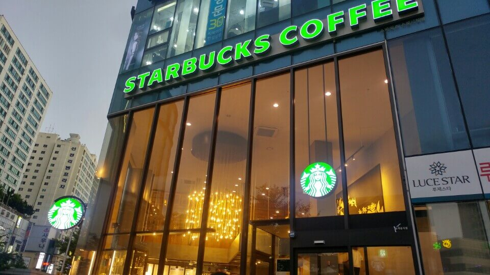
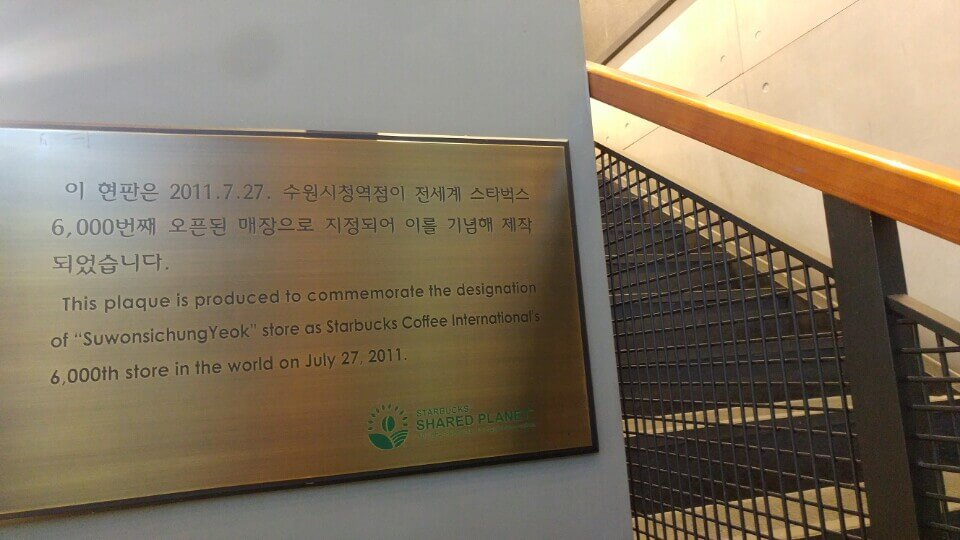
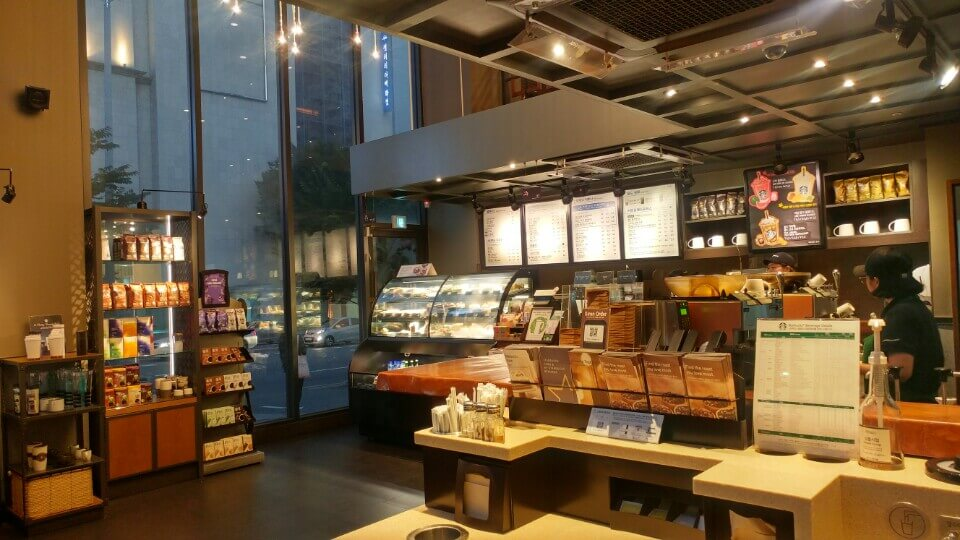
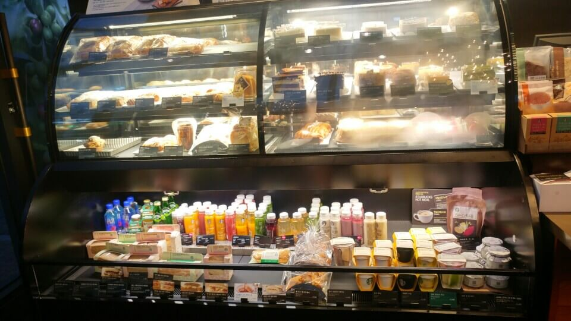
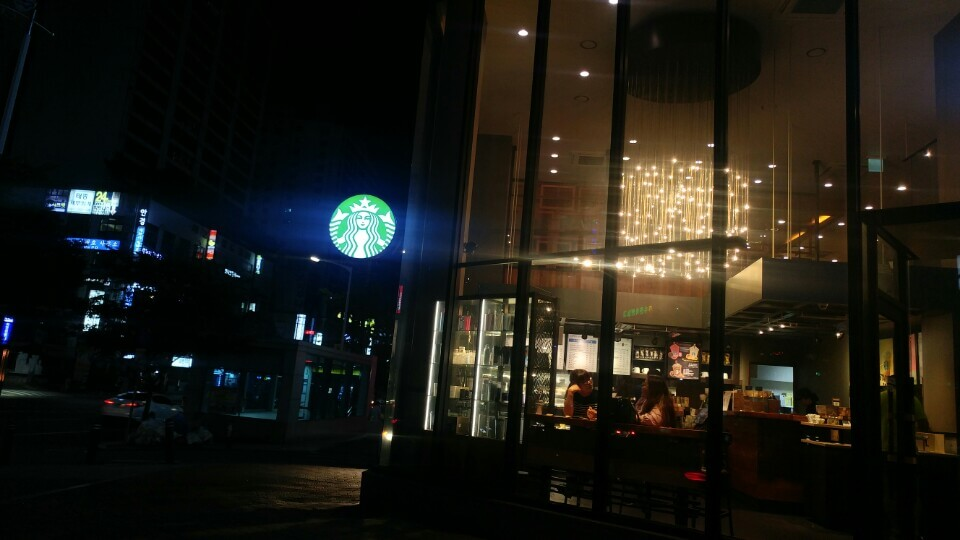
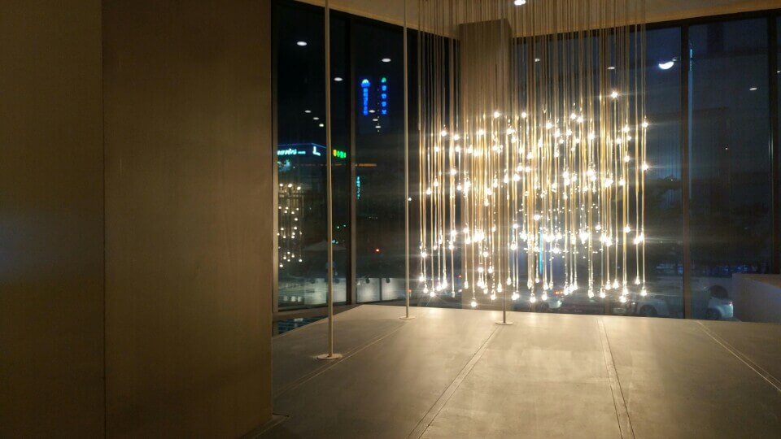
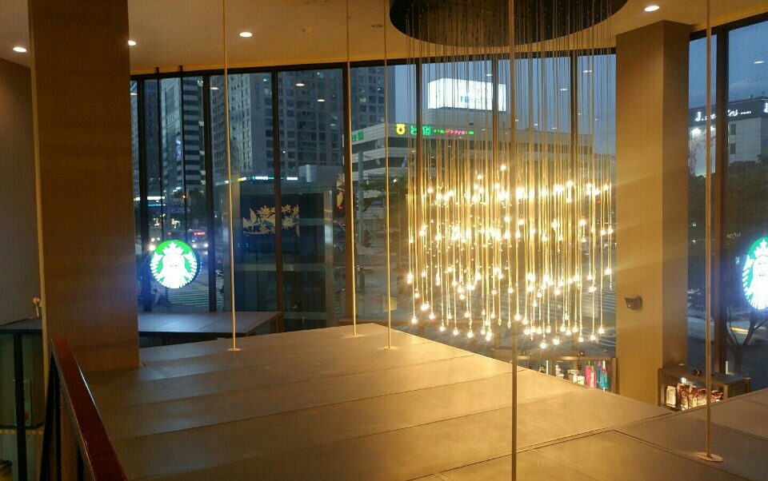
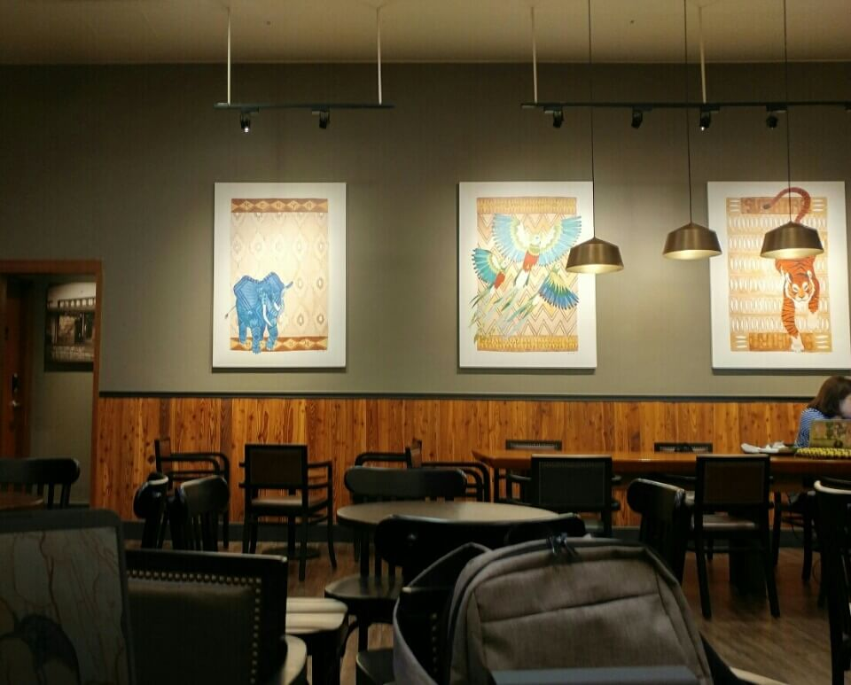
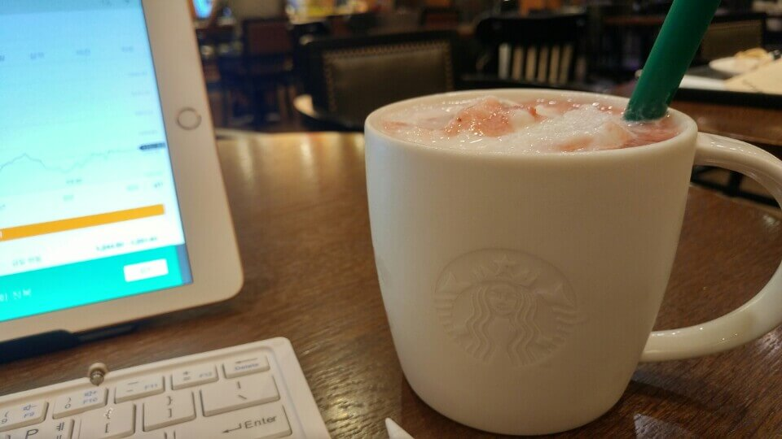

# 우리집에서 가장 가까운 스타벅스

세계에서 가장 큰 스타벅스, 세계에서 가장 오래된 스타벅스 등등 누구에게나 의미있는 스타벅스가 있다면 누구에게만 의미가 있는 스타벅스도 있다.

스타벅스 수원시청점이 나에게만 주는 의미는 지금 내가 살고있는 곳에서 가장 가까운 곳에 있는 스타벅스라는 것이고, 누구에게나 특별한 의미는 **전 세계에서 6000번째로 오픈된 스타벅스**라는 것이다.

매장관리도 준수한 편이라고 생각된다. 스타벅스의 모든 서비스를 이용하기엔 부담스러운 구조지만, 접할 수 없었던 제품들은 없었다. 매장의 인테리어도 쾌적하고 아늑한게 열심히 살고싶은 마음을 뿜뿜하게 해주는? **스타벅스의 브랜드 이미지가 그대로 전달되는** 그런 구조였다. 

이 매장의 마스코트는 샹들리에가 아닐까 싶다.  1층과 2층사이에 천장이 없어서 매장 천장높이가 높은 것도 내 취향과 참 잘 맞았다.

# 분위기

유흥가에서 살짝 떨어진 오피스텔, 은행가 주변의 카페이다 보니 카페에 오는 사람들의 비중이 적절하다. 수다목적의 사람들과 혼자와서 업무보는 사람들의 비중이 6:4에서 7:3정도 되는 듯 싶다.

좌석도 많고 사람들도 적당히 오는 편이라 분위기는 쾌적한 편이라고 할 수 있다.
음 그리고 수다에 적합한 좌석(높이가 낮은 테이블과 쇼파)들을 모아놓은 구간과 업무에 적합한 좌석(적당한 높이의 테이블과 콘센트)들을 모아놓은 구간을 적합하게 분리해 놓아서 어떤 목적이던지 잘 다녀갈 수 있는 곳이 될 것이다.

# 2018년의 7월을 보내고, 8월을 준비하면서

뒤돌아보면 가장 게으르기도 했고, 가장 많은 변화를 겪기도 했던 7월이었다.

8월은 7월에 겪었던 변화의 체계를 잡고, 유지해나갈 기판이 다져지는 달이 되었으면 한다.
물론 벌려놓은 일들이 참 많아서.. 이 일들을 잘 처리하기만 해도 매우 성공적이겠지만ㅠㅠ